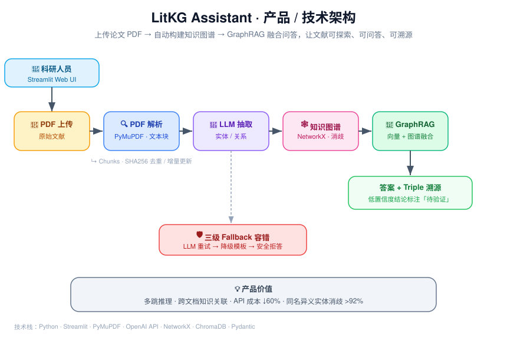

# LitKG Assistant — 文献阅读知识图谱助手

> 📚 上传论文 PDF → 自动抽取实体/关系 → 构建知识图谱 → 智能问答

## 简介

LitKG Assistant 面向科研人员，将论文 PDF 自动转化为结构化知识图谱（KG），并基于 GraphRAG 模式提供自然语言问答。

**当前版本：MVP-0 — 单论文闭环（命令行）**

- PDF 解析（PyMuPDF）
- LLM 实体/关系抽取（3 实体 + 2 关系）
- networkx 知识图谱（JSON 持久化）
- 命令行纯图检索问答

## 项目结构

```
litkg-assistant/
├── app/                        # 前端应用（MVP-1 启用）
│   ├── pages/                  # Streamlit 多页面
├── core/                       # 核心模块
│   ├── models.py               # 数据模型定义（Pydantic）
│   ├── pdf_parser.py           # PDF 解析模块
│   ├── entity_extractor.py     # LLM 实体/关系抽取
│   ├── kg_store.py             # 知识图谱存储
│   ├── graphrag.py             # GraphRAG 问答
│   └── prompts/                # LLM Prompt 模板
├── config/
│   └── settings.py             # 全局配置管理
├── data/
│   ├── papers/                 # 上传的 PDF 原文
│   ├── chunks/                 # 解析后的文本块缓存
│   └── kg.json                 # 知识图谱持久化
├── main.py                     # MVP-0 主入口
├── .env.example                # 环境变量模板
├── requirements.txt            # 依赖清单
└── README.md
```

## 快速开始

### 1. 环境要求

- Python 3.10+
- pip

### 2. 安装

```bash
# 克隆或进入项目目录
cd litkg-assistant

# 创建虚拟环境（推荐）
python -m venv venv

# 激活虚拟环境
# Windows:
venv\Scripts\activate
# Linux/macOS:
source venv/bin/activate

# 安装依赖
pip install -r requirements.txt
```

### 3. 配置

```bash
# 复制环境变量模板
cp .env.example .env

# 编辑 .env，填入你的 LLM API 配置
# 至少需要修改：
#   LLM_API_KEY=你的API密钥
#   LLM_BASE_URL=你的API地址
#   LLM_MODEL_NAME=模型名称
```

### 4. 运行 MVP-0

```bash
# 命令行交互模式
python main.py

# 或指定 PDF 文件直接处理
python main.py --pdf path/to/paper.pdf
```

运行后按提示输入问题即可。

### 5. 退出

在问答循环中输入 `exit` 或 `quit`。

## MVP 里程碑

| 里程碑 | 内容 | 状态 |
|--------|------|------|
| **MVP-0** | 单论文闭环：解析→抽取→存图→纯图问答 | 🚧 开发中 |
| **MVP-1** | 多论文+向量库+GraphRAG+Streamlit UI | 📋 待开发 |
| **MVP-2** | 实体消歧+增量更新+可视化+容错 | 📋 待开发 |

## 技术栈

- **PDF 解析**: PyMuPDF (fitz)
- **LLM 调用**: OpenAI 兼容 API
- **数据校验**: Pydantic v2
- **图谱存储**: NetworkX + JSON
- **容错重试**: Tenacity
- **配置管理**: python-dotenv
---

### 🖼 效果展示 / 系统架构



**核心处理链路**：PDF 上传 → PyMuPDF 解析为文本块（SHA256 增量去重）→ LLM 抽取实体/关系 → NetworkX 构建知识图谱（三级实体消歧）→ ChromaDB 向量 + 图谱融合的 GraphRAG 问答 → 答案附带 Triple 溯源。

### 🚀 关键指标

| 指标 | 结果 |
|------|------|
| 实体 / 关系类型 | 10 / 10 种 |
| 实体消歧准确率 | > 92% |
| API 成本节省 | 60%+（Chunk 级增量更新） |
| LLM 容错 | 三级 Fallback（重试 → 降级模板 → 安全拒答） |
| 溯源能力 | Triple 级，低置信度结论标注「待验证」 |

### 💡 产品思考（AI 产品岗面试可用）

- **痛点驱动**：科研人员「逐篇阅读」效率低，且难以建立跨论文的知识关联；把非结构化 PDF 升级为可探索、可问答、可溯源的结构化知识库。
- **优先级取舍**：MVP 先打通「上传→抽取→图谱→问答」单论文闭环验证价值，再迭代多论文、可视化与增量更新。
- **成本意识**：用 Chunk 级 SHA256 去重做增量更新，把 API 成本压降 60%+，体现工程与产品的平衡。
- **可信赖性设计**：三级实体消歧解决同名异义，Triple 溯源为低置信结论标注「待验证」，把「AI 幻觉」变成可审计的产品特性。

> 在线 Demo：（部署 Streamlit Community Cloud 后填入 URL，如 https://litkg-assistant.streamlit.app ）

## License

MIT
