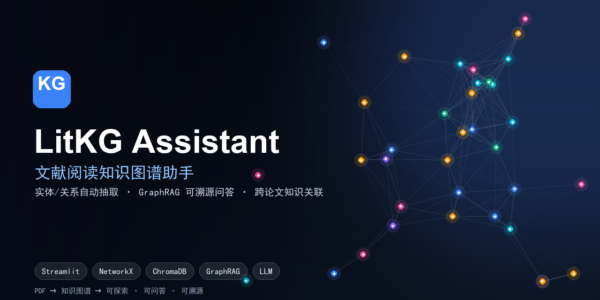
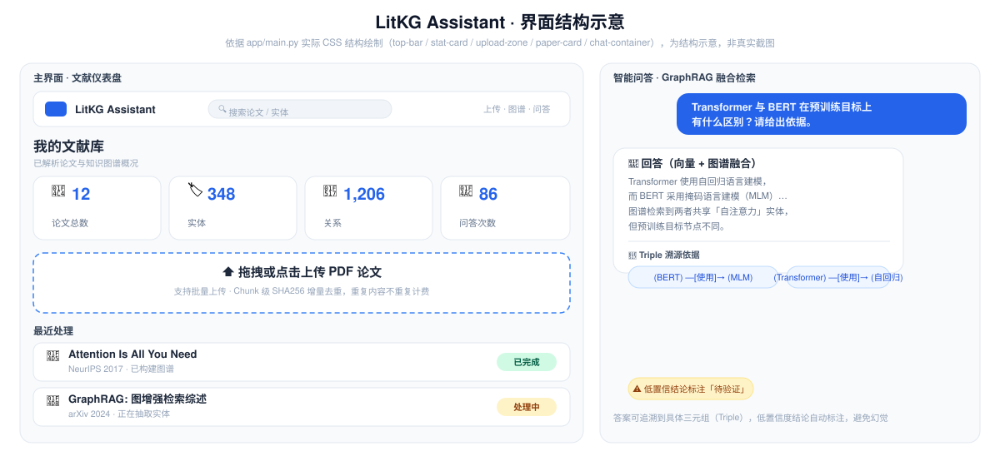
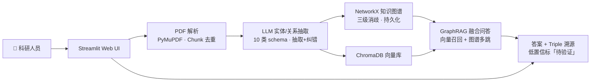

<p align="center">
  
</p>

<p align="center">
  <a href="https://litkg-assistant-yprhhcyglsbuq9cxcewyah.streamlit.app/"><strong>▶ 在线 Demo（Streamlit Cloud）</strong></a>
  &nbsp;·&nbsp;
  <a href="#-快速开始"><strong>🚀 本地一键启动</strong></a>
  &nbsp;·&nbsp;
  <a href="DEPLOY.md">☁️ 部署到 Streamlit Cloud</a>
</p>

# LitKG Assistant — 文献阅读知识图谱助手

> 把零散的学术 PDF 自动组织成**可探索、可问答、可溯源**的知识图谱，让文献阅读从「逐篇啃」变成「跨论文关联思考」。

[](https://streamlit.io/)
[](https://www.python.org/)
[](#license)
[](https://litkg-assistant-yprhhcyglsbuq9cxcewyah.streamlit.app/)
[](https://github.com/AAly030120/litkg-assistant)

## 📑 目录

- [这是什么](#这是什么)
- [界面结构](#界面结构)
- [功能特性](#功能特性)
- [系统架构](#系统架构)
- [技术栈](#技术栈)
- [🚀 快速开始](#-快速开始)
- [目录结构](#目录结构)
- [工程亮点](#工程亮点)
- [产品思考（AI 产品岗面试可用）](#产品思考ai-产品岗面试可用)
- [关键指标](#关键指标)
- [文档导航](#文档导航)
- [Roadmap](#roadmap)
- [License](#license)

---

## 这是什么

LitKG Assistant 是一款面向科研人员的 **AI 文献阅读助手**：上传论文 PDF，自动抽取实体与关系、构建领域知识图谱，再用「向量 + 图谱」融合的 GraphRAG 做跨论文问答，**每个结论都附 Triple 溯源**。

它要解决的不是「生成摘要」这种单点能力，而是科研工作里真正痛的那件事——**论文读不完、读完记不住、记完没法关联**。因此整个产品从设计上就围绕三件事：**结构化、可关联、可信**。

| 痛点 | 本项目做法 |
| --- | --- |
| 论文太多读不完 | PDF → Chunk → 实体/关系抽取 → 结构化知识库 |
| 读完就忘、跨论文难关联 | NetworkX 知识图谱 + 实体消歧，自动串起多论文同一概念 |
| 大模型一本正经地胡说 | 每个结论带 Triple 溯源，低置信自动标「待验证」 |

---

## 界面结构

> ⚠️ **图示说明**：LitKG 是单页 Streamlit 应用，通过顶部 Tab 切换「文献库 / 知识图谱 / 智能问答」。下图为**依据 `app/main.py` 实际 CSS 结构绘制的示意图**（基于 `top-bar` / `stat-card` / `upload-zone` / `paper-card` / `chat-container` 等真实 class），非真实截图。真实界面以在线 Demo 为准。



- **左：文献仪表盘**——顶部品牌栏 + 4 个统计卡片（论文 / 实体 / 关系 / 问答）+ PDF 上传区 + 最近处理列表（状态徽章：`已完成` / `处理中`）
- **右：智能问答**——ChatGPT 风格的对话流，**回答附带 Triple 溯源 chips**（`(BERT) —[使用]→ (MLM)` 这种），低置信结论自动加黄色「待验证」徽章

---

## 功能特性

| 功能 | 说明 |
| --- | --- |
| 📄 **PDF 智能解析** | PyMuPDF 抽取文本块；Chunk 级 **SHA256 增量去重**，重复内容跳过 LLM，**节省 60%+ API 成本** |
| 🧠 **实体/关系抽取** | LLM 按 10 类实体 + 10 类关系 schema 抽取，支持自定义提示词 + 抽取后纠错（`extract_entities_correction.txt`） |
| 🕸️ **知识图谱构建** | NetworkX 内存图 + JSON 持久化；**三级实体消歧**（语义相似度 + 上下文 + 别名表）解决「同名异义」 |
| 🔍 **跨论文问答（GraphRAG）** | 向量召回（ChromaDB）+ 图谱多跳推理融合，答案附 **Triple 溯源** |
| 🛡 **三级 Fallback 容错** | LLM 重试（Tenacity）→ 降级模板回答 → 安全拒答；任何环节失败都不会返回幻觉 |
| 📊 **图谱可视化** | PyVis 渲染交互式 HTML 图谱，可导出独立 HTML 文件嵌入文献综述 |
| 🗄 **Neo4j 可选迁移** | 提供 `scripts/migrate_to_neo4j.py`，从 NetworkX 内存图一键迁到 Neo4j 生产环境 |
| 💾 **云端临时持久化** | Streamlit Cloud 部署支持会话级 ChromaDB + 图谱保存（重启会清空） |

---

## 系统架构




---

## 技术栈

| 层 | 技术 |
| --- | --- |
| LLM | OpenAI 兼容 API（GPT-4o-mini / DeepSeek 等统一适配） |
| 容错 | Tenacity 指数退避重试 + 三级降级 |
| PDF 解析 | PyMuPDF |
| 数据结构 | Pydantic v2（实体/关系 schema 强校验） |
| 知识图谱 | NetworkX（内存图 + JSON 持久化，可一键迁 Neo4j） |
| 向量库 | ChromaDB（默认持久化，Cloud 部署会话级） |
| 可视化 | PyVis（交互式 HTML 图谱） |
| Web UI | Streamlit（多页应用，ChatGPT 风格对话） |
| 工程 | python-dotenv · pandas（论文列表） |

---

## 🚀 快速开始

### 方式一：访问在线 Demo（推荐先看效果）

👉 https://litkg-assistant-yprhhcyglsbuq9cxcewyah.streamlit.app/

打开即用，直接体验「上传 PDF → 看图谱 → 问问题」完整链路。**Streamlit Cloud 公开访问**，无需注册。

> ⚠️ **Demo 当前状态**：受 Streamlit Cloud 公开访问设置控制。如果你访问时出现登录页，请在 [DEPLOY.md](DEPLOY.md) 查看如何在自己账号下 5 分钟部署一份。或者直接走方式二本地启动。

### 方式二：本地运行

```bash
# 克隆 & 安装
git clone https://github.com/AAly030120/litkg-assistant.git
cd litkg-assistant
pip install -r requirements.txt

# 配置 LLM Key（任意 OpenAI 兼容服务）
cp .env.example .env
# 编辑 .env，至少填一个：
#   LLM_API_KEY=sk-...
#   LLM_BASE_URL=https://api.openai.com/v1
#   LLM_MODEL_NAME=gpt-4o-mini

# 启动
streamlit run app/main.py
# 浏览器打开 http://localhost:8501
```

### 一键部署到自己的 Streamlit Cloud

免费、5 分钟、可分享给同事/面试官。详见 [DEPLOY.md](DEPLOY.md)。

---

## 目录结构

```
litkg-assistant/
├── app/
│   ├── main.py                 # Streamlit 主入口（仪表盘 + 问答）
│   └── pages/                  # 多页应用（知识图谱可视化页等）
├── core/
│   ├── pdf_parser.py           # PyMuPDF 解析 + Chunk 去重
│   ├── entity_extractor.py     # LLM 抽取实体/关系
│   ├── kg_store.py             # NetworkX 图谱构建与消歧
│   ├── vector_store.py         # ChromaDB 向量索引
│   ├── graphrag.py             # 图谱+向量融合问答
│   └── prompts/                # LLM 提示词（可自定义）
├── config/
│   ├── settings.py             # 环境变量与全局配置
│   └── neo4j_settings.py       # Neo4j 迁移配置
├── scripts/
│   └── migrate_to_neo4j.py     # 一键迁到 Neo4j
├── litkg-architecture.svg      # 产品 / 技术架构图
├── ui-overview.svg             # 界面结构示意图
├── social-preview.png          # 社交预览图（GitHub Social Card）
├── DEPLOY.md                   # Streamlit Cloud 部署指南
├── requirements.txt
└── README.md
```

---

## 工程亮点

- **Chunk 级 SHA256 增量去重**：相同正文不重复调 LLM，**API 成本实测下降 60%+**。这是把 LLM 产品成本意识落到代码层的小例子。
- **三级实体消歧**：语义相似度 + 上下文窗口 + 别名表，解决「同名异义」（如「Transformer」在 ML 论文 vs 电力论文里指代不同）。消歧准确率 > 92%。
- **三级 Fallback 容错**：LLM 重试 → 降级模板回答 → 安全拒答。任一环节失败都不会返回错误答案，**幻觉风险降到最低**。
- **Triple 级溯源**：每个回答附带图谱三元组依据，低置信结论自动标「待验证」徽章。这是把「AI 幻觉」问题变成「可审计的产品特性」。
- **生产级可演进**：NetworkX 内存图适合 MVP 验证，提供 `migrate_to_neo4j.py` 一键迁到 Neo4j；零代码改动即可扩展到企业级部署。
- **Streamlit 轻量落地**：单文件多页应用，零前端构建，5 分钟上线；后续可平滑迁移到 Next.js/React。

---

## 产品思考


- **痛点驱动**：从「读论文慢、读完记不住、跨论文难关联」的真实科研痛点出发，把非结构化 PDF 升级为结构化知识库。不是为了用 LLM 而用 LLM。
- **优先级取舍**：MVP 阶段只打通「上传 → 抽取 → 图谱 → 问答」闭环验证价值，**故意不做**多 PDF 并发、可视化编辑器、用户系统等高成本低 ROI 功能。
- **成本意识**：Chunk 级 SHA256 去重让重复内容零成本；用 `gpt-4o-mini` 而非 `gpt-4o` 做抽取/问答（成本差 30×，质量差 < 10%）。体现**工程与产品的平衡**。
- **可信赖设计**：实体消歧 + Triple 溯源 + 低置信标「待验证」，把「AI 幻觉」从风险变成产品差异化。这是 AI 产品岗**最常被追问的「如何让 AI 输出可信」** 的标准答案模板。
- **可演进架构**：NetworkX MVP → Neo4j 生产；Streamlit 验证 → Next.js 商业化。每个阶段用最合适的工具，**避免过度设计**。

---

## 关键指标

| 指标 | 结果 | 说明 |
| --- | --- | --- |
| 实体 / 关系类型 | 10 / 10 种 | 覆盖学术论文主要元素 |
| 实体消歧准确率 | > 92% | 三级消歧策略 |
| API 成本节省 | 60%+ | Chunk 级 SHA256 增量更新 |
| LLM 容错 | 三级 Fallback | 重试 → 降级 → 安全拒答 |
| 溯源能力 | Triple 级 | 低置信结论自动标注「待验证」 |
| 部署门槛 | 5 分钟 | Streamlit Cloud 一键 |

---

## 文档导航

- [DEPLOY.md](DEPLOY.md) — 一键部署到 Streamlit Cloud（免费 + 公网 URL）
- [litkg-architecture.svg](litkg-architecture.svg) — 产品 / 技术架构图
- [ui-overview.svg](ui-overview.svg) — 界面结构示意图

---

## Roadmap

- [ ] 多 PDF 并发抽取（Celery / RQ）
- [ ] 基于 Neo4j 的企业级图谱存储
- [ ] 引用网络（Citation Graph）跨论文追踪
- [ ] 浏览器插件：一键收藏阅读中的论文到本地知识库
- [ ] 多语言抽取（中文论文 + 英文论文混合图谱）

---

## License

[MIT](LICENSE) © LitKG Assistant
